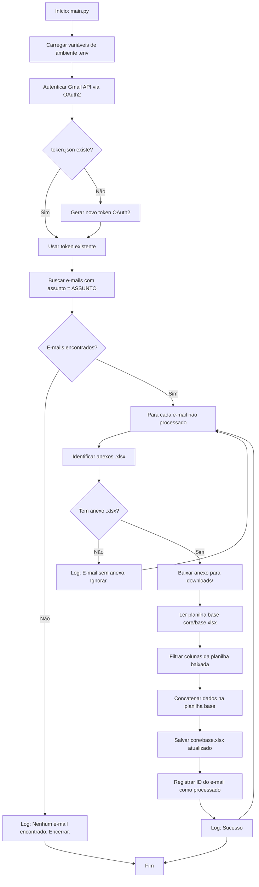
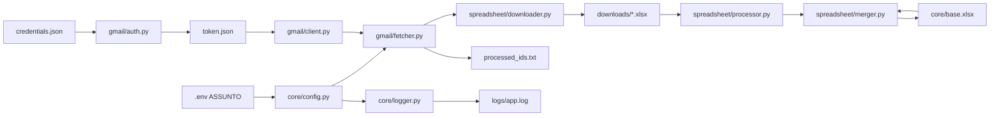

# PRD — Gmail XLSX Sync

---

## 1. Visão Geral

**Nome do projeto:** `gmail_xlsx_sync`
**Versão:** 1.0
**Tipo:** Script Python CLI — sem interface gráfica
**Linguagem:** Python 3.13
**Execução:** Manual ou agendada via cron/scheduler externo

---

## 2. Sobre o Produto

O `gmail_xlsx_sync` é um script Python que se conecta à conta Gmail do usuário via OAuth2 (Google API), busca e-mails cujo assunto contenha o valor definido na variável de ambiente `ASSUNTO`, baixa os anexos `.xlsx` encontrados nesses e-mails e concatena as informações da planilha baixada à planilha base localizada em `core/base.xlsx`. Durante a concatenação, apenas as colunas presentes na planilha base são aproveitadas.

---

## 3. Propósito

Automatizar a coleta e consolidação de dados recebidos por e-mail em formato de planilha, eliminando o processo manual de download e cópia de dados, reduzindo erros humanos e economizando tempo operacional.

---

## 4. Público-Alvo

- Analistas de dados que recebem relatórios periódicos por e-mail em formato `.xlsx`.
- Times de operações e financeiro que precisam consolidar planilhas distribuídas via Gmail.
- Desenvolvedores que buscam automatizar pipelines simples de coleta de dados.

---

## 5. Objetivos

- [ ] Autenticar na Gmail API usando OAuth2 sem necessidade de login interativo após setup inicial.
- [ ] Buscar e-mails pelo assunto configurado via `.env` (`ASSUNTO`).
- [ ] Baixar anexos `.xlsx` dos e-mails encontrados.
- [ ] Concatenar os dados baixados na planilha base (`core/base.xlsx`), respeitando apenas as colunas existentes na base.
- [ ] Registrar todas as operações em logs.
- [ ] Não ser over-engineered: código simples, direto e bem organizado por responsabilidade.

---

## 6. Requisitos Funcionais

### 6.1 Autenticação Gmail

- O sistema deve autenticar na Gmail API usando OAuth2.
- As credenciais OAuth2 (`credentials.json`) devem ser configuradas uma única vez via Google Cloud Console.
- O token gerado (`token.json`) deve ser armazenado localmente para reutilização.
- Após o setup inicial, nenhum login interativo deve ser solicitado.
- Escopos necessários: `gmail.readonly`.

### 6.2 Busca de E-mails

- O sistema deve buscar e-mails na caixa de entrada cujo assunto contenha o valor de `ASSUNTO` (lido do `.env`).
- A busca deve considerar apenas e-mails não processados anteriormente (controle via arquivo de IDs processados ou label).
- Os e-mails devem ser filtrados por assunto usando a query nativa da Gmail API (`subject:VALOR`).

### 6.3 Download de Anexos

- O sistema deve identificar e baixar apenas anexos com extensão `.xlsx`.
- Os arquivos baixados devem ser salvos temporariamente em `downloads/`.
- Após o processamento, os arquivos temporários podem ser mantidos ou removidos conforme configuração.

### 6.4 Processamento e Concatenação de Planilhas

- O sistema deve ler a planilha base localizada em `core/base.xlsx`.
- Para cada planilha baixada, deve:
  - Ler o conteúdo do arquivo `.xlsx`.
  - Filtrar apenas as colunas que existem na planilha base.
  - Concatenar os dados (append) na planilha base.
- A planilha base deve ser atualizada e salva após cada ciclo de processamento.
- Colunas não presentes na base devem ser ignoradas silenciosamente.

### 6.5 Logging

- Todas as operações devem ser registradas em `logs/app.log`.
- O log deve conter: timestamp, nível (INFO/WARNING/ERROR), módulo e mensagem.
- Erros não devem interromper o processamento dos demais e-mails.

---

### 6.6 Fluxo Principal



---

## 7. Requisitos Não-Funcionais

- **Linguagem:** Python 3.13, PEP 8, aspas simples.
- **Código em inglês:** variáveis, funções, comentários e docstrings em inglês.
- **Sem interface:** execução 100% via terminal.
- **Sem Django:** projeto Python puro.
- **Sem over-engineering:** nenhum framework web, ORM, ou abstração desnecessária.
- **Segurança:** credenciais nunca versionadas; `.env` e `credentials.json` no `.gitignore`.
- **Idempotência:** e-mails já processados não devem ser reprocessados.
- **Logs rotativos:** utilizar `RotatingFileHandler` para evitar arquivos de log muito grandes.
- **Dependências mínimas:** apenas bibliotecas estritamente necessárias.

---

## 8. Arquitetura Técnica

### 8.1 Stack

| Componente         | Tecnologia                          |
|--------------------|-------------------------------------|
| Linguagem          | Python 3.13                         |
| Gmail API          | `google-api-python-client`          |
| OAuth2             | `google-auth`, `google-auth-oauthlib` |
| Planilhas          | `openpyxl`, `pandas`                |
| Variáveis de env   | `python-dotenv`                     |
| Logs               | `logging` (stdlib)                  |
| Execução           | Script CLI (`main.py`)              |

### 8.2 Estrutura de Diretórios

```
gmail_xlsx_sync/
├── core/
│   ├── __init__.py
│   ├── config.py          # carrega .env e expõe constantes
│   ├── logger.py          # configuração centralizada de logging
│   └── base.xlsx          # planilha base (dados consolidados)
│
├── gmail/
│   ├── __init__.py
│   ├── auth.py            # autenticação OAuth2 Gmail
│   ├── client.py          # inicialização do cliente Gmail API
│   └── fetcher.py         # busca e-mails por assunto e extrai anexos
│
├── spreadsheet/
│   ├── __init__.py
│   ├── downloader.py      # salva anexos .xlsx em downloads/
│   ├── processor.py       # lê xlsx baixado e filtra colunas
│   └── merger.py          # concatena dados na planilha base
│
├── downloads/             # arquivos xlsx baixados (temporários)
│   └── .gitkeep
│
├── logs/                  # arquivos de log
│   └── .gitkeep
│
├── credentials.json       # OAuth2 credentials (NÃO versionar)
├── token.json             # OAuth2 token gerado (NÃO versionar)
├── processed_ids.txt      # IDs de e-mails já processados
├── .env                   # variáveis de ambiente (NÃO versionar)
├── .env.example           # template de variáveis
├── .gitignore
├── main.py                # entry point do script
├── requirements.txt
└── README.md
```

### 8.3 Fluxo de Dados



---

## 9. Design System

> Não aplicável — o projeto não possui interface gráfica. Toda a interação é via terminal e logs.

---

## 10. User Stories

### Épico: Consolidação automática de planilhas recebidas por e-mail

---

**US-01 — Autenticação sem interação**
> Como operador do sistema, quero que após o setup inicial a autenticação Gmail ocorra automaticamente, para que o script possa ser agendado sem supervisão humana.

**Critérios de aceite:**
- [ ] Dado que `credentials.json` existe e `token.json` foi gerado no setup, quando `main.py` é executado, então nenhuma janela ou prompt de login é exibido.
- [ ] Dado que o token expirou, quando `main.py` é executado, então o token é renovado automaticamente usando o refresh token.
- [ ] Dado que `credentials.json` não existe, quando `main.py` é executado, então o sistema exibe mensagem de erro clara no log e encerra.

---

**US-02 — Busca de e-mails por assunto**
> Como operador, quero que o script encontre apenas os e-mails cujo assunto contenha o valor de `ASSUNTO`, para evitar processar e-mails irrelevantes.

**Critérios de aceite:**
- [ ] Dado que existem e-mails com o assunto configurado, quando o script executa, então apenas esses e-mails são processados.
- [ ] Dado que nenhum e-mail corresponde ao assunto, quando o script executa, então o log registra a ausência e o script encerra sem erros.
- [ ] Dado que um e-mail já foi processado (ID presente em `processed_ids.txt`), quando o script executa, então ele é ignorado.

---

**US-03 — Download de anexos .xlsx**
> Como operador, quero que apenas anexos `.xlsx` sejam baixados, para evitar processar outros tipos de arquivo.

**Critérios de aceite:**
- [ ] Dado que um e-mail tem anexo `.xlsx`, quando processado, então o arquivo é salvo em `downloads/`.
- [ ] Dado que um e-mail tem anexo de outro tipo (`.pdf`, `.csv`), quando processado, então o anexo é ignorado e o log registra o evento.
- [ ] Dado que um e-mail não tem anexos, quando processado, então o log registra e o script segue para o próximo e-mail.

---

**US-04 — Concatenação de dados na planilha base**
> Como analista, quero que os dados das planilhas baixadas sejam adicionados à planilha base, para que eu tenha os dados consolidados em um único arquivo.

**Critérios de aceite:**
- [ ] Dado que a planilha baixada tem colunas iguais às da base, quando processada, então todas as linhas são concatenadas à base.
- [ ] Dado que a planilha baixada tem colunas extras, quando processada, então apenas as colunas presentes na base são aproveitadas.
- [ ] Dado que a planilha baixada não tem nenhuma coluna em comum com a base, quando processada, então nenhuma linha é adicionada e o log registra o aviso.
- [ ] Dado que a planilha base não existe, quando o script executa, então o log registra erro crítico e o script encerra.

---

## 11. Métricas de Sucesso

| Métrica                                      | Meta                        |
|----------------------------------------------|-----------------------------|
| Execuções sem erro em ambiente de produção   | ≥ 95% das execuções         |
| Tempo de processamento por e-mail            | < 10 segundos               |
| E-mails reprocessados indevidamente          | 0                           |
| Colunas incorretas concatenadas na base      | 0                           |
| Cobertura de logs (toda ação registrada)     | 100%                        |

---

## 12. Riscos e Mitigações

| Risco                                                  | Probabilidade | Impacto | Mitigação                                                            |
|--------------------------------------------------------|---------------|---------|----------------------------------------------------------------------|
| Token OAuth2 expirado sem refresh token válido         | Média         | Alto    | Tratar exceção e logar mensagem clara de reautenticação manual.      |
| Planilha baixada com estrutura completamente diferente | Baixa         | Médio   | Filtro de colunas + log de aviso quando nenhuma coluna coincide.     |
| Planilha base corrompida ou inexistente                | Baixa         | Alto    | Verificar existência e integridade no início da execução.            |
| Quota da Gmail API excedida                            | Baixa         | Médio   | Tratar `HttpError 429`, logar e encerrar graciosamente.              |
| E-mail com múltiplos anexos `.xlsx`                    | Média         | Baixo   | Processar todos os anexos `.xlsx` do e-mail individualmente.         |
| Credenciais versionadas acidentalmente                 | Baixa         | Alto    | `.gitignore` obrigatório para `credentials.json`, `token.json`, `.env`. |

---

## 13. Lista de Tarefas (Sprints)

---

### Sprint 1 — Setup e Autenticação

#### Tarefa 1.1 — Inicializar projeto
- [ ] 1.1.1 Criar estrutura de diretórios: `core/`, `gmail/`, `spreadsheet/`, `downloads/`, `logs/`
- [ ] 1.1.2 Criar `__init__.py` em todos os módulos
- [ ] 1.1.3 Criar `.gitignore` incluindo `.env`, `credentials.json`, `token.json`, `downloads/`, `logs/`
- [ ] 1.1.4 Criar `requirements.txt` com: `google-api-python-client`, `google-auth-httplib2`, `google-auth-oauthlib`, `openpyxl`, `pandas`, `python-dotenv`
- [ ] 1.1.5 Criar `.env.example` com todas as variáveis necessárias documentadas
- [ ] 1.1.6 Criar `README.md` com instruções de setup (Google Cloud Console, OAuth2, configuração de `.env`)

#### Tarefa 1.2 — Configuração central (`core/config.py`)
- [ ] 1.2.1 Implementar carregamento do `.env` usando `python-dotenv`
- [ ] 1.2.2 Expor constantes: `ASSUNTO`, `BASE_SPREADSHEET_PATH`, `DOWNLOADS_DIR`, `PROCESSED_IDS_FILE`
- [ ] 1.2.3 Validar que `ASSUNTO` não está vazio; lançar `ValueError` com mensagem clara caso esteja
- [ ] 1.2.4 Validar existência de `BASE_SPREADSHEET_PATH`; lançar `FileNotFoundError` caso ausente

#### Tarefa 1.3 — Logger centralizado (`core/logger.py`)
- [ ] 1.3.1 Configurar `logging.getLogger('gmail_xlsx_sync')`
- [ ] 1.3.2 Adicionar handler de arquivo com `RotatingFileHandler` (max 5MB, 3 backups)
- [ ] 1.3.3 Adicionar handler de console (`StreamHandler`)
- [ ] 1.3.4 Formato do log: `%(asctime)s | %(levelname)s | %(name)s | %(message)s`
- [ ] 1.3.5 Expor função `get_logger(name)` para uso nos demais módulos

#### Tarefa 1.4 — Autenticação Gmail OAuth2 (`gmail/auth.py`)
- [ ] 1.4.1 Implementar função `get_credentials()` que carrega `token.json` se existir
- [ ] 1.4.2 Verificar validade do token; usar `refresh_token` se expirado
- [ ] 1.4.3 Caso `token.json` não exista, iniciar fluxo `InstalledAppFlow` com `credentials.json`
- [ ] 1.4.4 Salvar novo token em `token.json` após autenticação inicial
- [ ] 1.4.5 Tratar `FileNotFoundError` para `credentials.json` com log de erro e exit
- [ ] 1.4.6 Escopos: `['https://www.googleapis.com/auth/gmail.readonly']`

#### Tarefa 1.5 — Cliente Gmail (`gmail/client.py`)
- [ ] 1.5.1 Implementar função `build_gmail_client()` que chama `get_credentials()` e retorna service object
- [ ] 1.5.2 Tratar exceções de conexão com log e re-raise

---

### Sprint 2 — Busca e Download

#### Tarefa 2.1 — Busca de e-mails (`gmail/fetcher.py`)
- [ ] 2.1.1 Implementar `fetch_emails_by_subject(service, subject)` usando query `subject:{subject}`
- [ ] 2.1.2 Implementar paginação para retornar todos os e-mails encontrados (não só a primeira página)
- [ ] 2.1.3 Implementar `get_processed_ids()` que lê `processed_ids.txt` e retorna um `set`
- [ ] 2.1.4 Implementar `mark_as_processed(email_id)` que appenda o ID ao `processed_ids.txt`
- [ ] 2.1.5 Filtrar e-mails já processados antes de retornar a lista
- [ ] 2.1.6 Implementar `get_attachments(service, email_id)` que retorna lista de partes com extensão `.xlsx`
- [ ] 2.1.7 Logar: quantidade de e-mails encontrados, quantidade já processados, quantidade a processar

#### Tarefa 2.2 — Download de anexos (`spreadsheet/downloader.py`)
- [ ] 2.2.1 Implementar `download_attachment(service, email_id, attachment_id, filename)` que usa `users().messages().attachments().get()`
- [ ] 2.2.2 Decodificar payload base64url do anexo
- [ ] 2.2.3 Salvar arquivo decodificado em `downloads/{filename}`
- [ ] 2.2.4 Tratar colisão de nomes adicionando timestamp ao nome do arquivo
- [ ] 2.2.5 Logar: nome do arquivo baixado, tamanho em bytes, caminho de destino
- [ ] 2.2.6 Tratar exceções de I/O com log de erro

---

### Sprint 3 — Processamento e Concatenação de Planilhas

#### Tarefa 3.1 — Processador de planilha (`spreadsheet/processor.py`)
- [ ] 3.1.1 Implementar `read_xlsx(filepath)` que retorna um `pd.DataFrame`
- [ ] 3.1.2 Implementar `filter_columns(df_source, base_columns)` que retorna apenas as colunas presentes em `base_columns`
- [ ] 3.1.3 Logar colunas presentes na base, colunas encontradas no arquivo baixado, e colunas que serão ignoradas
- [ ] 3.1.4 Retornar `None` e logar aviso se nenhuma coluna coincide
- [ ] 3.1.5 Tratar exceções de leitura de arquivo com log de erro

#### Tarefa 3.2 — Merger de planilhas (`spreadsheet/merger.py`)
- [ ] 3.2.1 Implementar `load_base(base_path)` que carrega `core/base.xlsx` como `pd.DataFrame`
- [ ] 3.2.2 Implementar `merge_data(base_df, new_df)` que concatena os DataFrames via `pd.concat`
- [ ] 3.2.3 Implementar `save_base(df, base_path)` que salva o DataFrame atualizado em `core/base.xlsx`
- [ ] 3.2.4 Usar `openpyxl` como engine no `to_excel` para manter compatibilidade
- [ ] 3.2.5 Logar: quantidade de linhas antes e depois da concatenação
- [ ] 3.2.6 Tratar exceções de escrita com log de erro e não sobrescrever a base em caso de falha

---

### Sprint 4 — Orquestração e Entrypoint

#### Tarefa 4.1 — Entrypoint principal (`main.py`)
- [ ] 4.1.1 Importar e chamar `config.py` para validação inicial do ambiente
- [ ] 4.1.2 Inicializar logger via `core/logger.py`
- [ ] 4.1.3 Chamar `build_gmail_client()` de `gmail/client.py`
- [ ] 4.1.4 Chamar `fetch_emails_by_subject()` de `gmail/fetcher.py`
- [ ] 4.1.5 Para cada e-mail: chamar `get_attachments()`, `download_attachment()`, `read_xlsx()`, `filter_columns()`, `merge_data()`, `save_base()` e `mark_as_processed()`
- [ ] 4.1.6 Encapsular o loop em `try/except` para isolar falhas por e-mail
- [ ] 4.1.7 Logar resumo final: total processado, total com erro, total ignorado
- [ ] 4.1.8 Usar `if __name__ == '__main__':` como guard de execução

#### Tarefa 4.2 — Limpeza de downloads (opcional/configurável)
- [ ] 4.2.1 Adicionar variável `KEEP_DOWNLOADS` no `.env` (default: `true`)
- [ ] 4.2.2 Se `KEEP_DOWNLOADS=false`, deletar arquivo após processamento bem-sucedido
- [ ] 4.2.3 Logar remoção do arquivo

---

### Sprint 5 — Qualidade e Documentação

#### Tarefa 5.1 — Qualidade de código
- [ ] 5.1.1 Revisar todo o código com foco em PEP 8 (indentação, espaços, comprimento de linha ≤ 79 chars)
- [ ] 5.1.2 Garantir uso de aspas simples em todo o projeto
- [ ] 5.1.3 Adicionar docstrings em todas as funções públicas (formato Google style)
- [ ] 5.1.4 Verificar que nenhuma credencial ou dado sensível está hardcoded
- [ ] 5.1.5 Verificar que `credentials.json`, `token.json` e `.env` estão no `.gitignore`

#### Tarefa 5.2 — Documentação
- [ ] 5.2.1 Atualizar `README.md` com: pré-requisitos, instruções de instalação (`pip install -r requirements.txt`)
- [ ] 5.2.2 Documentar passo a passo para criar projeto no Google Cloud Console e gerar `credentials.json`
- [ ] 5.2.3 Documentar como configurar o `.env` com exemplo
- [ ] 5.2.4 Documentar como executar o script (`python main.py`)
- [ ] 5.2.5 Documentar como agendar via cron (exemplo de crontab)

#### Tarefa 5.3 — Testes (sprint futura)
- [ ] 5.3.1 Implementar testes unitários para `filter_columns()`
- [ ] 5.3.2 Implementar testes unitários para `merge_data()`
- [ ] 5.3.3 Implementar mock da Gmail API para testes de `fetcher.py`
- [ ] 5.3.4 Configurar `pytest` e `pytest-mock`

---


## 14. Exemplo de `.env`

```dotenv
# Assunto do e-mail a ser buscado no Gmail
ASSUNTO=Relatório Financeiro Mensal

# Caminho para a planilha base (relativo à raiz do projeto)
BASE_SPREADSHEET_PATH=core/base.xlsx

# Diretório para salvar os anexos baixados
DOWNLOADS_DIR=downloads

# Arquivo de controle de IDs processados
PROCESSED_IDS_FILE=processed_ids.txt

# Manter arquivos baixados após processamento (true/false)
KEEP_DOWNLOADS=true
```

---

## 15. Dependências (`requirements.txt`)

```
google-api-python-client==2.131.0
google-auth-httplib2==0.2.0
google-auth-oauthlib==1.2.0
openpyxl==3.1.2
pandas==2.2.2
python-dotenv==1.0.1
```
